<table align="center" border="0">

<tr><td colspan=2 align="center">

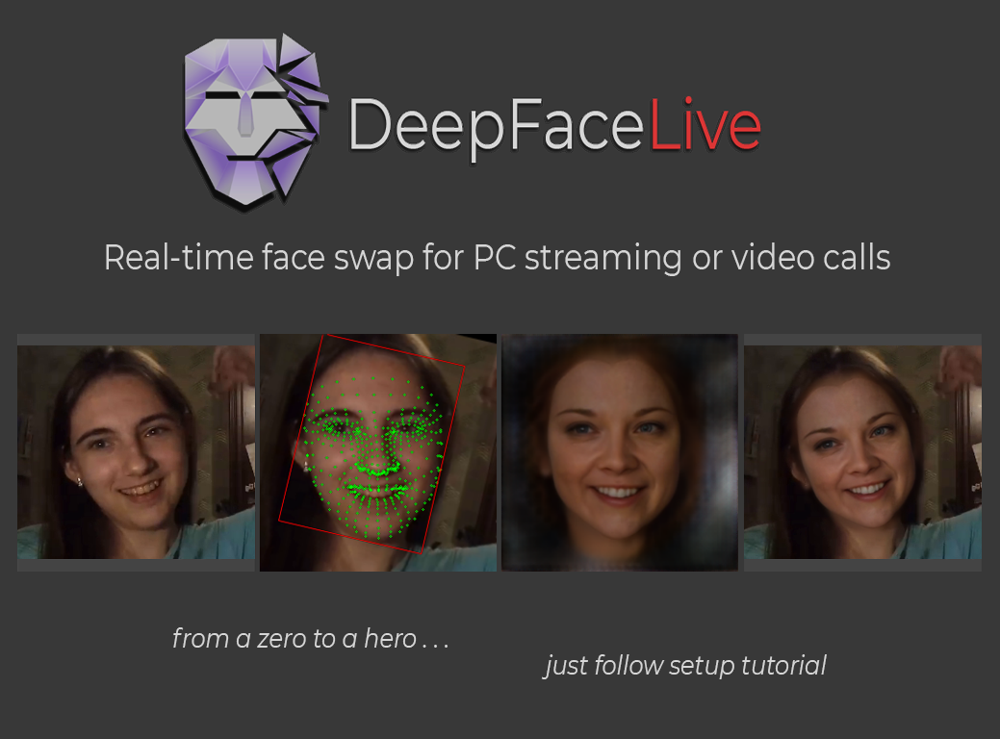

</td></tr>
</table>
<table align="center" border="0">

<tr><td colspan=2 align="center">

## Face Swap (DFM)

You can swap your face from a webcam or the face in the video using trained face models.

Here is a list of available ready-to-use public face models.

These persons do not exists. Similarities with real people are accidental. Except Keanu Reeves. He exists, and he's breathtaking!
</td></tr>

<tr><td colspan=2 align="center">

<table align="center" border="0">
<tr><td align="center">
Keanu Reeves

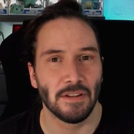</img>

<a href="doc/celebs/Keanu_Reeves/examples.md">examples</a>
</td><td align="center">
Irina Arty

</img>

examples
</td><td align="center">
Millie Park

</img>

examples
</td><td align="center">
Rob Doe

</img>

<a href="doc/celebs/Rob_Doe/examples.md">examples</a>
</td><td align="center">
Jesse Stat

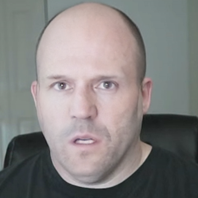</img>

examples
</td></tr>

</table>

<table align="center" border="0">
<tr><td align="center">
Bryan Greynolds

</img>

<a href="doc/celebs/Bryan_Greynolds/examples.md">examples</a>
</td><td align="center">
Mr. Bean

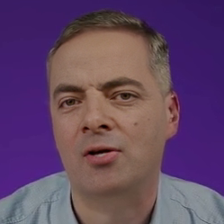</img>

examples
</td><td align="center">
Ewon Spice

</img>

<a href="doc/celebs/Ewon_Spice/examples.md">examples</a>

</td><td align="center">
Natasha Former

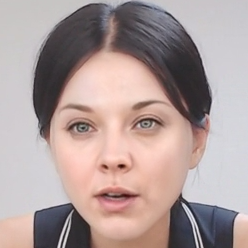</img>

<a href="doc/celebs/Natasha_Former/examples.md">examples</a>

</td><td align="center">
Emily Winston

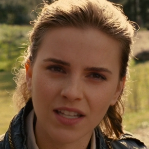</img>

<a href="doc/celebs/Emily_Winston/examples.md">examples</a>

</td></tr></table>
<table align="center" border="0">
<tr><td align="center">
Ava de Addario

</img>

<a href="doc/celebs/Ava_de_Addario/examples.md">examples</a>
</td><td align="center">
Dilraba Dilmurat

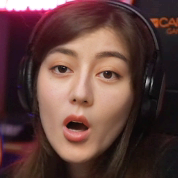</img>

examples
</td><td align="center">
Matilda Bobbie

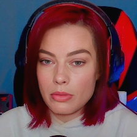</img>

<a href="doc/celebs/Matilda_Bobbie/examples.md">examples</a>
</td><td align="center">
Yohanna Coralson

</img>

<a href="doc/celebs/Yohanna_Coralson/examples.md">examples</a>

</td><td align="center">
Amber Song

</img>

examples

</td></tr></table>
<table align="center" border="0">
<tr align="center"><td align="center">
Kim Jarrey

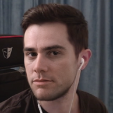</img>

<a href="doc/celebs/Kim_Jarrey/examples.md">examples</a>
</td><td align="center">
David Kovalniy

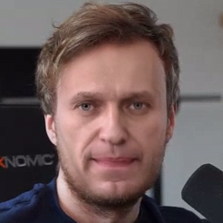</img>

<a href="doc/celebs/David_Kovalniy/examples.md">examples</a>
</td><td align="center">
Jackie Chan

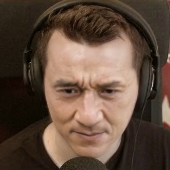</img>

examples
</td><td align="center">
Nicola Badge

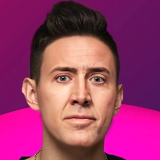</img>

<a href="doc/celebs/Nicola_Badge/examples.md">examples</a>
</td><td align="center">
Joker

</img>

examples
</td></tr></table>
<table align="center" border="0">
<tr align="center"><td>
Dean Wiesel

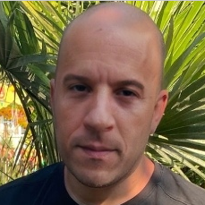</img>

<a href="doc/celebs/Dean_Wiesel/examples.md">examples</a>
</td><td align="center">
Silwan Stillwone

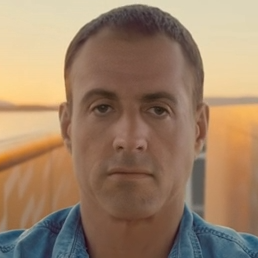</img>

<a href="doc/celebs/Silwan_Stillwone/examples.md">examples</a>
</td><td align="center">
Tim Chrys

</img>

<a href="doc/celebs/Tim_Chrys/examples.md">examples</a>

</td><td align="center">
Zahar Lupin

</img>

<a href="doc/celebs/Zahar_Lupin/examples.md">examples</a>
</td><td align="center">
Tim Norland

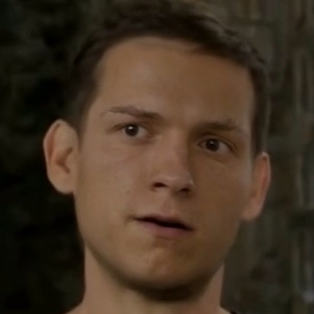</img>

<a href="doc/celebs/Tim_Norland/examples.md">examples</a>
</td></tr></table>

<table align="center" border="0">
<tr align="center"><td>
Natalie Fatman

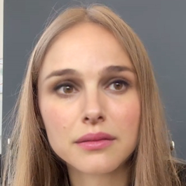</img>

<a href="doc/celebs/Natalie_Fatman/examples.md">examples</a>
</td><td align="center">
Liu Lice

</img>

<a href="doc/celebs/Liu_Lice/examples.md">examples</a>
</td><td align="center">
Albica Johns

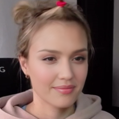</img>

<a href="doc/celebs/Albica_Johns/examples.md">examples</a>

</td><td align="center">
Meggie Merkel

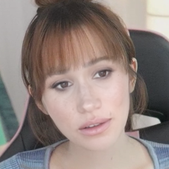</img>

<a href="doc/celebs/Meggie_Merkel/examples.md">examples</a>
</td><td align="center">
Tina Shift

</img>

<a href="doc/celebs/Tina_Shift/examples.md">examples</a>
</td></tr></table>

</td></tr>

<tr><td colspan=2 align="center">
If you want a higher quality or better face match, you can train your own face model using <a href="https://github.com/iperov/DeepFaceLab">DeepFaceLab</a>

Here is an <a href="https://www.tiktok.com/@arnoldschwarzneggar/video/6995538782204300545">example</a> of Arnold Schwarzneggar trained on a particular face and used in a video call. Read the FAQ for more information.

</td></tr>

</table>
<table align="center" border="0">

<tr><td colspan=2 align="center">

## Face Swap (Insight)

You can swap your face from a webcam or the face in the video using your own single photo.

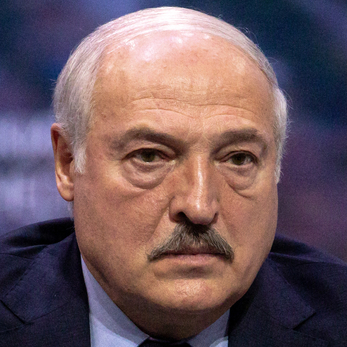</img>

</img>

</td></tr>

</table>
<table align="center" border="0">

<tr><td colspan=2 align="center">

## Face Animator

There is also a Face Animator module in DeepFaceLive app. You can control a static face picture using video or your own face from the camera. The quality is not the best, and requires fine face matching and tuning parameters for every face pair, but enough for funny videos and memes or real-time streaming at 25 fps using 35 TFLOPS GPU.

</img>

Here is a [mini video](doc/FaceAnimator_tutor.webm?raw=true) showing the process of setting up the Face Animator for Obama controlling Kim Chen's face.

</td></tr>

</table>

<table align="center" border="0">

<tr><td colspan=2 align="center">

## System requirements

any DirectX12 compatible graphics card

(Recommended RTX 2070+ / Radeon RX 5700 XT+ )

Modern CPU with AVX instructions

4GB RAM, 32GB+ paging file

Windows 10

</td></tr>
<tr><td colspan=2 align="center">

## Documentation

</td></tr>
<tr><td align="right">
Windows
</td><td align="left">

<a href="doc/windows/main_setup.md">Main setup</a>

- <a href="doc/windows/for_streaming.md">additional setup for streaming</a>

- <a href="doc/windows/for_video_calls.md">additional setup for video calls</a>       

<a href="doc/windows/using_android_phone_camera.md">Using Android phone camera</a>  

</td></tr>
<tr><td align="right">
Linux
</td><td align="left">
<a href="build/linux">Build info</a>
</td></tr>
<tr><td align="right">
Frequently asked questions
</td><td align="left">
<a href="doc/user_faq/user_faq.md">for User</a>

<a href="doc/developer_faq/developer_faq.md">for Developer</a>
</td></tr>
<tr><td colspan=2 align="center">

## Releases

</td></tr>
<tr><td align="right">

<a href="https://disk.yandex.ru/d/7i5XTKIKVg5UUg">Windows 10 x64 (yandex.ru)</a>

<a href="https://mega.nz/folder/m10iELBK#Y0H6BflF9C4k_clYofC7yA">Windows 10 x64 (mega.nz)</a>

</td><td align="left">
Contains stand-alone zero-dependency all-in-one ready-to-use portable self-extracting folder! You don't need to install anything other than video drivers.
  
DirectX12 build : NVIDIA, AMD, Intel videocards.
  
NVIDIA build : NVIDIA cards only, GT730 and higher. Works faster than DX12. FaceMerger can work also on AMD/Intel.
</td></tr>
<tr><td colspan=2 align="center">

## Communication groups

<tr><td align="right">
<a href="https://discord.gg/rxa7h9M6rH">Discord</a>
</td><td align="left">Official discord channel. English / Russian.</td></tr>

<tr><td align="right">
QQ群124500433
</td><td align="left">中文交流QQ群，商务合作找群主</td></tr>

</td></tr>
<tr><td colspan=2 align="center">

## How can I help the project?

</td></tr>
<tr><td colspan=2 align="center">
Train your own face model by following the recommendations in the FAQ section and share it on Discord. If the model fits the quality, it will be added to the public library.
</td></tr>
<tr><td colspan=2 align="center">
Register github account and push "Star" button.
</td></tr>
<!--<tr><td colspan=2 align="center">
<a href="https://www.paypal.com/paypalme/DeepFaceLab">Donate via Paypal</a>
</td></tr>-->
<tr><td colspan=2 align="center">
<a href="https://yoomoney.ru/to/41001142318065">Donate via Yoomoney</a>
</td></tr>
<tr><td colspan=2 align="center">
bitcoin:bc1qewl062v70rszulml3f0mjdjrys8uxdydw3v6rq
</td></tr>
<tr><td colspan=2 align="center">

<!--
    <a href="https://br-stone.online"></img></a><a href="https://exmo.com"></img></a>

    presents

    <tr><td align="right">

    <a href="">Windows (magnet link)</a>
    </td><td align="center">Latest release. Use torrent client to download.</td></tr>
    </tr>
-->

</table>

