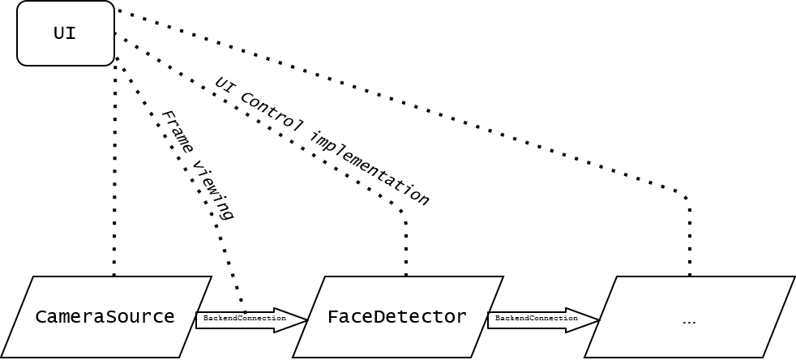

<table align="center" border="0">
<tr><td colspan=2 align="center">

## Why Python for such high load software and not C++?

All CPU-intensive tasks are done by native libraries compiled for Python, such as OpenCV, NumPy, PyQt, onnxruntime. Python is more like a command processor that tells what to do. All you need is to organize such commands properly.

## What does the internal architecture look like?

</img>

It consists of backend modules that work in separate processes. The modules work like a conveyor belt. CameraSource(FileSource) generates the frame and sends it to the next module for processing, so the final FPS is equal to the FPS of the slowest module. The final output module outputs the stream to the screen with the desired delay, which helps to synchronize the sound. Backend modules manage the abstract controls that are implemented in the UI. Thus, the Model-View-Controller pattern is implemented. To reduce latency, some custom interprocess communication elements are implemented directly in Python.

## How many people were involved in the development? 

Just me. It took eight months from scratch until the first release.

</td></tr>
</table>

