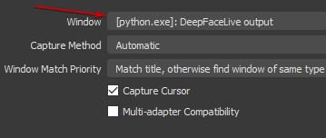
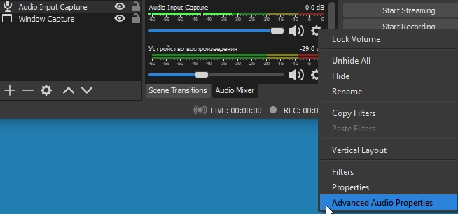
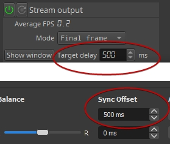
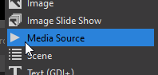

<table align="center" border="0">
<tr><td colspan=2 align="center">

# Setup for streaming

DeepFaceLive only provides a video window of the replaced face. Since the face must be processed, this takes time, so the video window shows the stream with some delay.

So, what do we need for streaming?

Capture window (or receive mpegts udp stream) and sound with some delay, transmit to streaming service (e.g. twitch, youtube, ...)

Below, one of the solutions.

### Run **_OBS Studio_**

</img>

</td></tr>
<tr><td colspan=2 align="center">

### add **_Window capture_**

</img>

</td></tr>
<tr><td colspan=2 align="center">

### choose **_DeepFaceLive output_** window

</img>

</td></tr>
<tr><td colspan=2 align="center">

### add **_Audio Input Capture_**

</mg>

</td></tr>
<tr><td colspan=2 align="center">

### select your microphone device

</img>

</td></tr>
<tr><td colspan=2 align="center">

### open **_Advanced Audio Properties_** for **_Audio Input Capture_**

</img>

</td></tr>
<tr><td colspan=2 align="center">

### set **_Sync Offset_** the same as **_Target Delay_** in **_Stream Output_**

</img>

</td></tr>
<tr><td colspan=2 align="center">

### **DONE** !
### Now you can stream yourself to a stream service.

</td></tr>

<tr><td colspan=2 align="center">

### instead of **Window capture** 

you can use **Media Source**

</img>

with configuration:

</img>

enable mpegts in **_Stream Output_**

</img>

</td></tr>

</table>