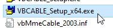

<table align="center" border="0">
<tr><td colspan=2 align="center">

# Setup for video calls

DeepFaceLive only provides a video window of the replaced face. Since the face must be processed, this takes time, so the video window shows the stream with some delay.

So, what do we need for video calls?

1) capture the window and translate it into a virtual camera, which can be selected in video call programs.

2) capture the sound and transfer it to the virtual microphone with some delay, which you can also select in the video calling programs.

Below, one of the solutions.

</td></tr>
<tr><td colspan=2 align="center">

### Download <a href="https://github.com/iperov/DeepFaceLive/releases/download/VBCABLE/VBCABLE_Driver_Pack43.zip"> **_VBCable driver_** </a> 

</td></tr>
<tr><td colspan=2 align="center">

### run setup for x64 and install

</img>

</img>

</td></tr>
<tr><td colspan=2 align="center">

### download and run <a href="https://github.com/iperov/DeepFaceLive/releases/download/AUDIOREPEATER/audiorepeater.exe"> audiorepeater.exe </a>

</td></tr>
<tr><td colspan=2 align="center">

Set **_wave in_** your microphone device.

Set **_wave out_** CABLE input (VB-Audio).

</img>

</td></tr>
<tr><td colspan=2 align="center">

### set **_Total buffer(ms)_** the same as **_Target Delay_** in **_Stream Output_**

</img>

</td></tr>
<tr><td colspan=2 align="center">

now start the repeater

</img>

</td></tr>
<tr><td colspan=2 align="center">

### Run **_OBS Studio_**

</img>

</td></tr>
<tr><td colspan=2 align="center">

### add **_Window capture_**

</img>

</td></tr>
<tr><td colspan=2 align="center">

### choose **_DeepFaceLive output_** window

</img>

</td></tr>
<tr><td colspan=2 align="center">

### start Virtual Camera

</img>

</td></tr>
<tr><td colspan=2 align="center">

in your video call software set **CABLE Output** as microphone, and **OBS Virtual Camera** as Camera.

example in **Discord**:

</img>

</img>

</td></tr>
<tr><td colspan=2 align="center">

### DONE !

### Now you can make video calls with a replaced face and synchronized sound in most programs.

</td></tr>

</table>