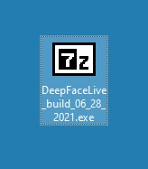
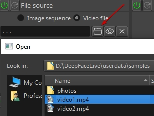
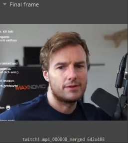
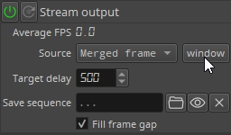
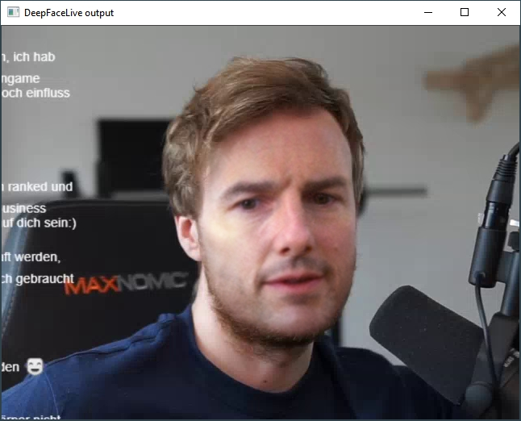
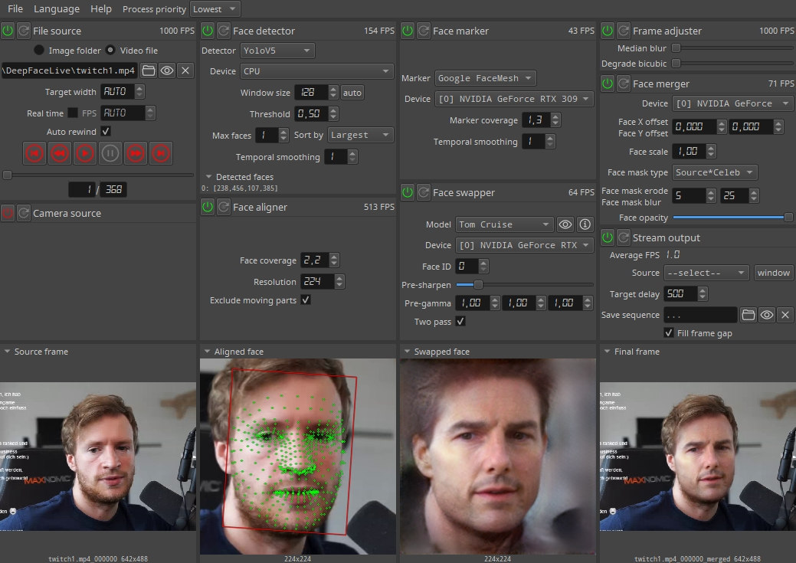

<table align="center" border="0">
<tr><td colspan=2 align="center">

## Windows 10 Quick Setup Tutorial

</td></tr>
<tr><td colspan=2 align="center">

### Install the latest Graphics Drivers for your videocard.

</img>

</td></tr>
<tr><td colspan=2 align="center">

### Set the total virtual memory to 32Gb or more.

</img>

</td></tr>
<tr><td colspan=2 align="center">

### Download the Windows build exe from one of the sources.

</img>

</td></tr>
<tr><td colspan=2 align="center">

### Run and unpack to the root of any disk.

</img>

</td></tr>
<tr><td colspan=2 align="center">

### Run the **_DeepFaceLive.bat_** file

</img>

</td></tr>
<tr><td colspan=2 align="center">

### Select a **_Video file_** from the samples in **_File source_**

</img>

</td></tr>
<tr><td colspan=2 align="center">

### or select the **_Device index_** and **_Driver_**  in **_Camera source_**

</img>

</td></tr>
<tr><td colspan=2 align="center">

### Choose the **_Face detector_** and **_Device_**

</img>

</td></tr>
<tr><td colspan=2 align="center">

### Choose the **_Face marker_** and **_Device_**

</img>

</td></tr>
<tr><td colspan=2 align="center">

### Choose a **_Model_** and **_Device_** in **_Face swapper_**

</img>

</td></tr>
<tr><td colspan=2 align="center">

### Now you see a swapped face in the **_Final frame_** preview window

</img>

</td></tr>
<tr><td colspan=2 align="center">

### Choose **_Merged frame_** as the **_Mode_** in **_Stream output_**, and press **_window_**

</img>

</td></tr>
<tr><td colspan=2 align="center">

### Now you see the **_DeepFaceLive output_** window

</img>

</td></tr>
<tr><td colspan=2 align="center">

### You can play with various parameters of the modules to achieve the best performance and quality.

</img>

</td></tr>
</table>

