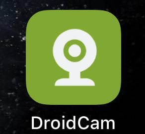
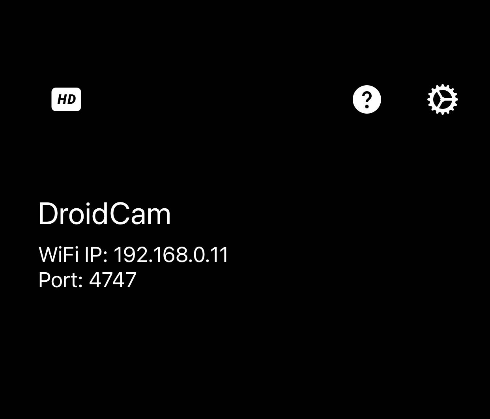
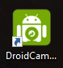
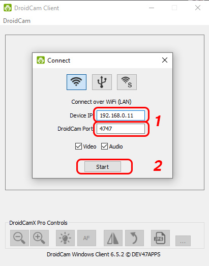
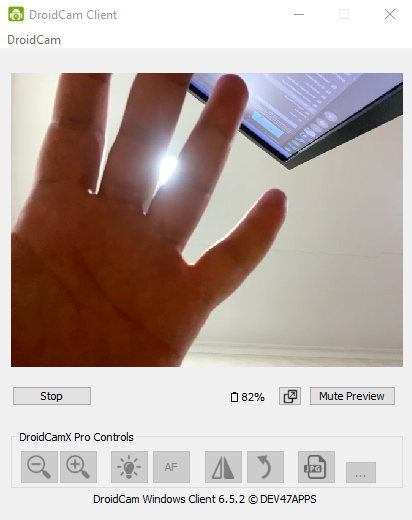
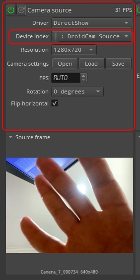

<table align="center" border="0">
<tr><td colspan=2 align="center">

# Using Android phone camera

### Download and install <a href="http://www.dev47apps.com/"> **_DroidCam_** </a>

Phone and PC should be in the same network.

Connect Phone to network through WiFi

### Run Phone App.

</img>

now we can see phone's IP and port.

</img>

### Run PC app

</img>

Check whether the data coincide with the data on the phone, if the figures differ, then bring them to the values that are on the phone screen, then press "Start"

</img>

If you have done everything correctly, the video from the phone camera should appear in the DroidCam window

</img>

### in **_CameraSource_** section
### in **_Driver_** select **_DirectShow_** 
### in **_Device index_** select **_DroidCamSource_**

</img>

</td></tr>

</table>